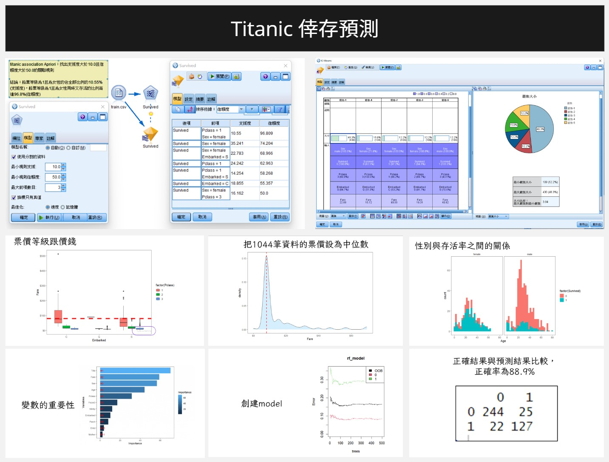

# 1112決策支援與商業智慧 期末專案
 

## Titanic倖存預測與數據分析

### 1. 數據來源
Kaggle Titanic - Machine Learning from Disaster
https://www.kaggle.com/competitions/titanic/data

### 2. Data資料夾
train.csv → MySQL、Python、R需要

test.csv() → Python、R需要

gender_submission.csv → 用R預測存活率時需要

train_forModeler.csv → SPSS modeler需要

### 3. MySQL資料儲存
「Train.sql」儲存資料庫為titanic、資料表為train的資料，請以Data Import匯入。

### 4. Python資料分析&圖表視覺化
以google colab環境編寫
https://colab.research.google.com/drive/1vXjSgma-Ruw9uJAJAgxNAgqdnYxdgeoL?usp=sharing

### 5. SPSS modeler機器學習分析

「SPSS Modeler分析titanic.docx」有分類、關聯、分群分析的截圖

「SPSS Modeler」資料夾內有所有.str

### 6. R語言資料分析&機器學習(使用Random Forest演算法)

檔案在「R」資料夾內

「titanic.R」按照此檔案內的程式碼執行，可獲得執行結果。

「R分析titanic.docx」有分析結果的截圖。

→預測test(測試集)的存活率

成功率(每次執行結果皆會不同)：可高達(244+127)/(244+127+25+22)×100% = 88.76%

